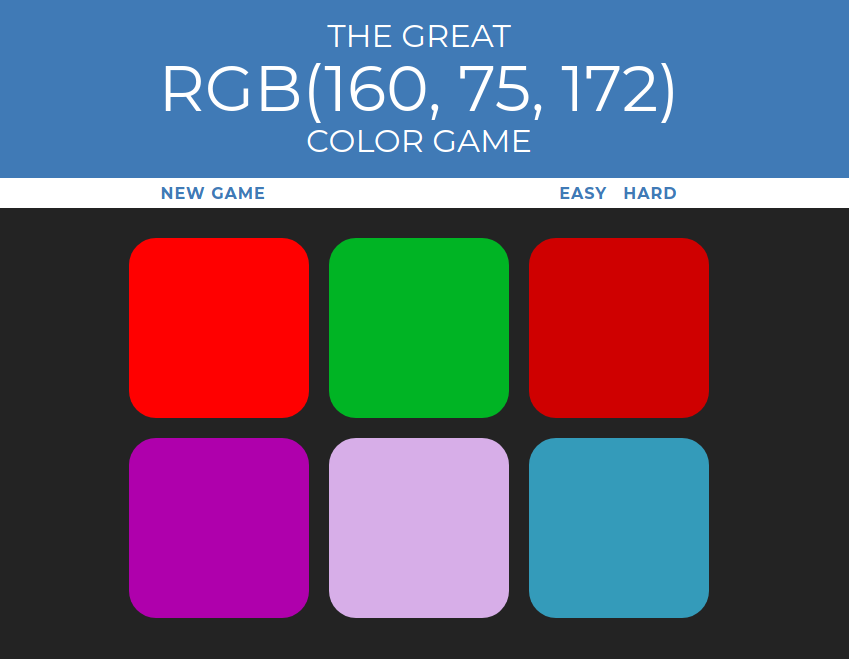

# Guess the Color

It is an interactive game to learn the RGB color model. Written using pure JavaScript, HTML, and CSS.



## RGB Color Model

The RGB color model is an additive color model in which red, green and blue light are added together in various ways to reproduce a broad array of colors. The name of the model comes from the initials of the three additive primary colors, red, green, and blue.

The syntax of RGB is as follows: ```rgb(r, g, b)```, where the value of each color range between 0 and 255. Black is at ```rgb(0, 0, 0)```, and white is at ```rgb(255, 255, 255)```.


## Features

* Two Modes (Easy / Hard) &rarr; the only difference is the number of squares generated.
* Randomized Colors

## Page published at:

[https://mthanasi.github.io/Guess-the-Color/](https://mthanasi.github.io/Guess-the-Color/)

## License
[MIT](https://choosealicense.com/licenses/mit/)
